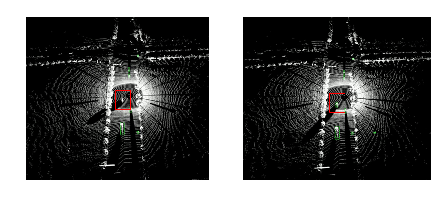

这是基于[mahalanobis_3d_multi_object_tracking](https://github.com/eddyhkchiu/mahalanobis_3d_multi_object_tracking)实现的三维点云多目标跟踪的代码。
需要基于检测过程的输出结果运行本代码。

`requirements.txt`中给出运行代码所需要的环境依赖。

运行过程如下：

```
python main_kitti.py test 0 iou 0.1 h false kitti results/000002
python main_kitti.py test 2 m 11 greedy true kitti results/000003
```

iou代表在data association时使用3D-IOU;
m代表在data association时使用Mahalanobis距离;
0,1,2代表Q和R的初始化状态。

结果保存在results中。

使用Mahalanobis距离时帧率更快 ，也可以避免丢失跟踪目标。


